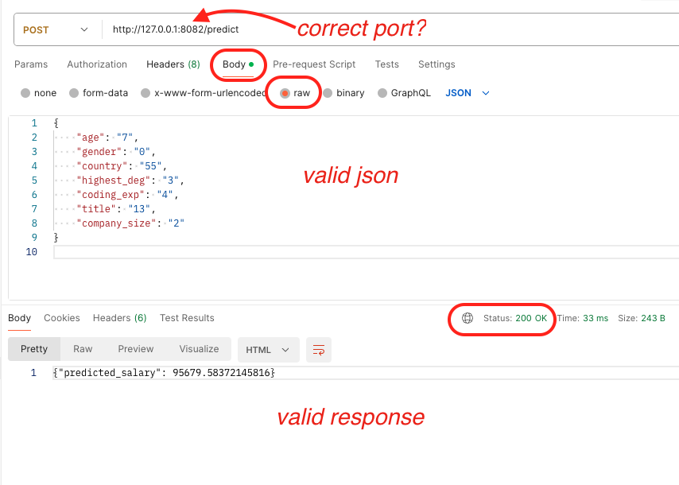

# 3300 - Salary Prediction Model API

 

This application uses Python [Flask](https://flask.palletsprojects.com/en/3.0.x/) to make the machine learning model available to users.

The API is not a complete implementation. It does not account for error handling yet.

The idea for this project came from [Predicting Year of Marriage - End to End Machine Learning Deployment with FLASK and AWS -PART 1](https://www.youtube.com/watch?v=sm5xeKal72I). I adapted to a data science salary prediction model and Microsoft Azure for purposes of teaching.

## To Run This Application  

1. Clone this repository to local computer

2. Create a new virtual environment

   - Windows: `python -m venv ./venv`
   - Mac: `python3 -m venv ./venv`

3. Activate the new virtual environment

   - Windows: `.\venv\Scripts\activate`
   - Mac: `source ./venv/bin/activate`

4. Install the dependencies `pip install -r requirements.txt`

5. Run the application with `flask run`
   a. To run a specific app: `flask --app app run`  
   b. To change the port: `flask run --port 8080`  
   c. To listen on all public IP addresses: `flask run --host 0.0.0.0`
   d. To run in debug mode: `flask run --debug`

   Example: `flask --app app run --port 8080 --debug `

## API endpoints

**/**  
Send a GET request to the root route to learn about the api

**/predict**  
Send a POST request with JSON data to the /predict route to recieve back a salary prediction in JSON format {"predicted\_salary": 00000.00}. Required data includes labels for categorical variables _age, gender, country, highest_deg, coding_exp, title_, and _company\_size_. Data must be sent in this order.

### Example JSON

```json
{
  "age": 7,
  "gender": 0,
  "country": 55,
  "highest_deg": 3,
  "coding_exp": 4,
  "title": 13,
  "company_size": 2
}
```
  
    
## To Do List

[ ] :pencil2:  Add error handling  
[ ] :pencil2:  Add application logging    
[ ] :pencil2:  Add /api/v1 url path  


  
## Categorical variable mappings

**_age mapping_**  
{0: '18-21', 1: '22-24', 2: '25-29', 3: '30-34', 4: '35-39', 5: '40-44', 6: '45-49', 7: '50-54', 8: '55-59', 9: '60-69', 10: '70+'}

**_gender mapping_**  
{0: 'Man', 1: 'Nonbinary', 2: 'Prefer not to say', 3: 'Prefer to self-describe', 4: 'Woman'}

**_country mapping_**  
{0: 'Algeria', 1: 'Argentina', 2: 'Australia', 3: 'Bangladesh', 4: 'Belgium', 5: 'Brazil', 6: 'Cameroon', 7: 'Canada', 8: 'Chile', 9: 'China', 10: 'Colombia', 11: 'Czech Republic', 12: 'Ecuador', 13: 'Egypt', 14: 'Ethiopia', 15: 'France', 16: 'Germany', 17: 'Ghana', 18: 'Hong Kong (S.A.R.)', 19: 'I do not wish to disclose my location', 20: 'India', 21: 'Indonesia', 22: 'Iran, Islamic Republic of...', 23: 'Ireland', 24: 'Israel', 25: 'Italy', 26: 'Japan', 27: 'Kenya', 28: 'Malaysia', 29: 'Mexico', 30: 'Morocco', 31: 'Nepal', 32: 'Netherlands', 33: 'Nigeria', 34: 'Other', 35: 'Pakistan', 36: 'Peru', 37: 'Philippines', 38: 'Poland', 39: 'Portugal', 40: 'Romania', 41: 'Russia', 42: 'Saudi Arabia', 43: 'Singapore', 44: 'South Africa', 45: 'South Korea', 46: 'Spain', 47: 'Sri Lanka', 48: 'Taiwan', 49: 'Thailand', 50: 'Tunisia', 51: 'Turkey', 52: 'Ukraine', 53: 'United Arab Emirates', 54: 'United Kingdom of Great Britain and Northern Ireland', 55: 'United States of America', 56: 'Viet Nam', 57: 'Zimbabwe'}

**_highest_deg mapping_**  
{0: 'Bachelor’s degree', 1: 'Doctoral degree', 2: 'I prefer not to answer', 3: 'Master’s degree', 4: 'No formal education past high school', 5: 'Professional doctorate', 6: 'Some college/university study without earning a bachelor’s degree'}

**_code_experience mapping_**  
{0: '1-3 years', 1: '10-20 years', 2: '20+ years', 3: '3-5 years', 4: '5-10 years', 5: '< 1 years', 6: 'I have never written code'}

**_current_title mapping_**  
{0: 'Data Administrator', 1: 'Data Analyst (Business, Marketing, Financial, Quantitative, etc)', 2: 'Data Architect', 3: 'Data Engineer', 4: 'Data Scientist', 5: 'Developer Advocate', 6: 'Engineer (non-software)', 7: 'Machine Learning/ MLops Engineer', 8: 'Manager (Program, Project, Operations, Executive-level, etc)', 9: 'Other', 10: 'Research Scientist', 11: 'Software Engineer', 12: 'Statistician', 13: 'Teacher / professor'}

**_company_size mapping_**  
{0: '0-49 employees', 1: '10,000 or more employees', 2: '1000-9,999 employees', 3: '250-999 employees', 4: '50-249 employees'}

## Sample data  

If using mc_salary_predict_model.ml, with the variables 7, 0, 55, 3, 4, 13, and 2 should return a predicted salary of 95679.58.


